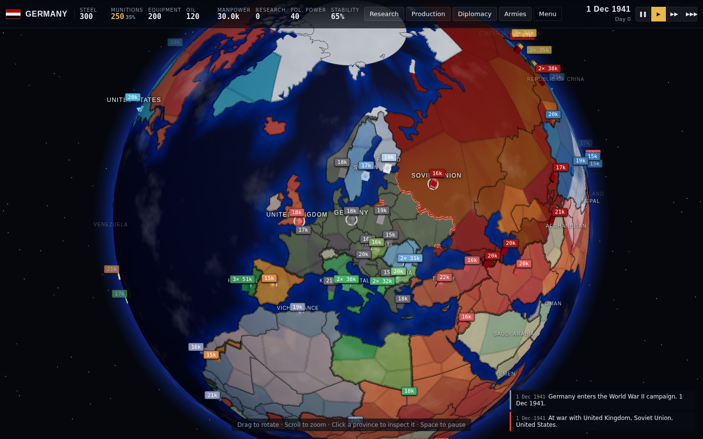
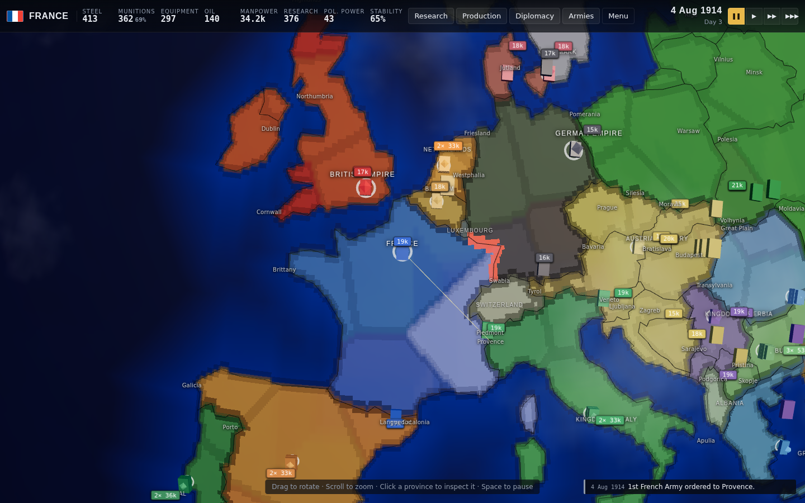
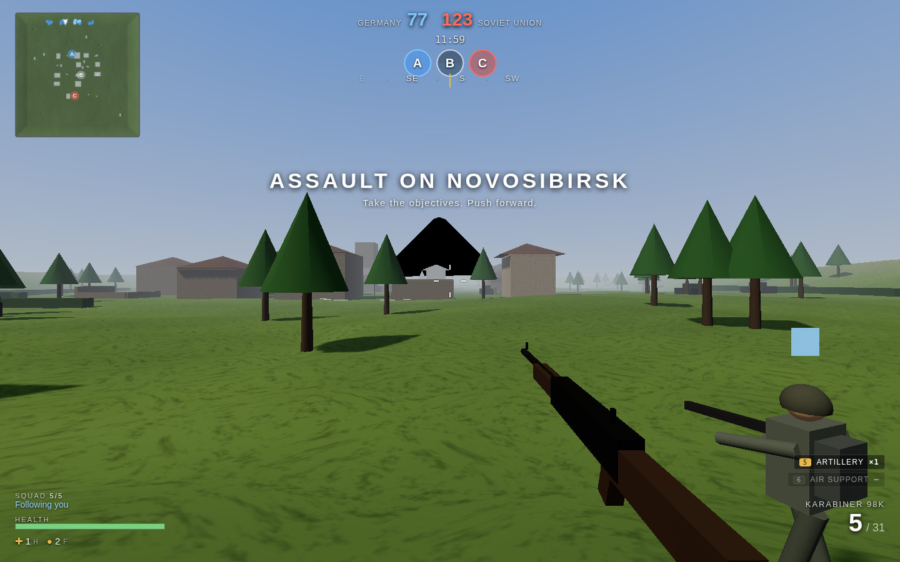

# Global Frontlines: Theater of War

A grand-strategy war game fused with a first-person shooter, running entirely in the browser.

Pick an era (**World War I**, **World War II**, **Present Day**) and a nation, then run your war from a
3D globe of the real world: economy, research, diplomacy and army movement. Borders and coastlines come
from Natural Earth, provinces are carved inside real countries and named after real regions and cities,
and each era starts from its historical political map: the empires of 1914, German-occupied Europe in
December 1941, and the blocs of 2026. Non-playable powers such as Austria-Hungary, Italy, China, Finland
and Ukraine act as AI nations, and dated historical events (Italy and the USA entering the Great War, the
Russian revolutions, Romania switching sides) fire as the calendar advances. When two armies collide you can
**Auto-Resolve** the battle or **Take Command** and drop into a first-person battlefield generated from
the strategic situation. Your munitions, equipment quality, artillery, air power and tech all follow you
onto the field, and the battle's outcome flows straight back to the map.





## Running it

```bash
npm install
npm run dev        # http://localhost:5173
npm run build      # production bundle in dist/
npm run preview    # serve the production bundle
npm run smoke      # headless Playwright walkthrough with screenshots (scripts/out/)
npm run mobile     # the same walkthrough on a phone viewport, driving the touch controls
                   # PORTRAIT=1 for portrait, VW/VH to pin an exact viewport
```

Requirements: a modern browser with WebGL 2. Plays with mouse and keyboard on a desktop, and with
on-screen controls on a phone or tablet.

## Playing on a phone or tablet

Touch is detected automatically; add `?touch=1` to the URL to force the on-screen controls on a
touch laptop, or `?touch=0` to force them off.

**Strategy layer** works in either orientation. One finger drags the globe, two fingers pinch to zoom,
and a tap selects a province. The panels become bottom sheets that scroll, and the top bar reflows into
compact rows so nothing runs off the edge.

The war log starts folded away on a phone so it does not cover the map; tap its header to open it.

**Battle layer** wants landscape, and says so if you hold the phone upright. The left half of the screen
is a floating thumbstick: put your thumb down anywhere and the stick appears there. The right half aims.
Fire, aim, reload, jump, crouch, sprint, grenade and medkit sit within reach of your right thumb; crouch
and sprint latch so you are not stuck holding them. Artillery, air support and squad orders are pills
along the top, showing how many calls you have left. MAP opens the command map, where one finger pans,
two fingers pinch, and a toolbar switches between selecting a squad, ordering it, and calling fire. The only data shipped is a 160 KB
Natural Earth extract (public domain, rebuilt with `node scripts/build-world-data.mjs`); every
battlefield, soldier, weapon and sound is generated procedurally at runtime.

## Deploying to Vercel

The repo is a static Vite site and ships with a `vercel.json`, so deployment is zero-config:

1. Import the repository at [vercel.com/new](https://vercel.com/new). Vercel detects the Vite framework
   preset; the config pins `npm ci` for install, `npm run build` for build and `dist` as the output.
2. Deploy. There are no environment variables, serverless functions or databases.

Or from the command line: `npx vercel --prod`. Every push to the connected branch produces a new
deployment; the `assets/` bundle is served with immutable caching and the Three.js chunk is split
from the game code so it stays cached between releases.

The headless smoke test uses `playwright-core` and needs a Chromium binary. Set `CHROME_PATH`, or run
`npx playwright install chromium` once, before `npm run smoke`.

## How to play

**Strategy layer**

* Drag to rotate the globe, scroll to zoom, click a province to inspect it.
* Select one of your armies in the province panel, then click a destination. Moving into enemy or
  neutral land starts a battle.
* Top-right tabs: **Research** (three branches, four tiers), **Production** (split factory output
  between munitions, equipment and construction steel), **Diplomacy** (relations, alliances, war,
  truces) and **Armies**.
* `Space` pauses, `1` `2` `3` set the speed, `Esc` closes whatever panel is open.

**Battle layer**

| Key | Action |
| --- | --- |
| `W A S D` / `Shift` / `Ctrl` / `Space` | Move / sprint / crouch / jump |
| `LMB` / `RMB` | Fire / aim down sights |
| `R` | Reload, or clear a jam |
| `1` `2` / wheel | Switch weapons |
| `F` / `H` | Grenade / medkit |
| `Q` / `E` | Squad: follow-hold toggle / attack-move to aim point |
| `5` / `6` / `7` | Artillery / air support / recon drone |
| `G` / `N` | Gas mask (WWI) / night vision (modern) |
| `Tab` | Command map: select squads, right-click to order, `Z`+click artillery, `X`+click air |

In a tank the camera chases the hull from behind and above: `W`/`S` drive, `A`/`D` steer, the mouse
swings the turret, `LMB` fires the main gun and `RMB` the coaxial machine gun. The gun shoots where the
crosshair points. On a phone the thumbstick drives, dragging aims, and FIRE and AIM are the two guns.
| `Esc` | Pause / withdraw |

**Difficulty.** Before deploying you pick a combat difficulty, remembered between battles. It controls
how quickly enemies spot and settle their aim on you, how far they engage from, how many of them may
shoot at you at once, how hard they hit, and how fast you recover between firefights.

| | Recruit | Regular | Veteran | Elite |
| --- | --- | --- | --- | --- |
| Enemies shooting at you at once | 2 | 3 | 4 | 8 |
| Time to aim at you | 1.7 s | 1.2 s | 0.7 s | 0.35 s |
| Damage you take | 45% | 60% | 85% | 100% |
| Health regen | fast | steady | slow | none |

Enemy AI engages at believable ranges (about 150 m with a rifle, 60 m with a submachine gun) rather than
across the whole map, needs a moment to bring its weapon to bear on a new contact, shoots worse while
suppressed or moving, and gives you a grace period after you redeploy. A red wedge around the crosshair
shows the bearing of whoever hit you.

Capture **A**, **B** and **C**. Holding more objectives than the enemy bleeds their tickets. Time keeps
passing on the globe while you fight (one day every 30 seconds), so a friendly army arriving at the
contested province shows up as reinforcements mid-battle.

## Roles and kits

* **Supreme Commander** — starts in the command map with extra strikes; direct squads and drop fire missions.
* **Squad Leader** — a squad of AI soldiers follows you and takes your orders.
* **Boots on the Ground** — Rifleman, Machine Gunner, SMG/Trench Raider, Medic, Marksman, or Tank Commander
  (a drivable tank with main gun and coaxial MG). Some kits are unlocked by research.

## Strategy → battle modifiers

| Strategic state | Battle effect |
| --- | --- |
| Munitions stockpile | Ammunition per soldier, artillery availability |
| Equipment quality | Weapon jam chance, AI accuracy |
| Artillery / air / drone tech | Support call-ins |
| Armour tech | Tank kit and AI tanks |
| Gas warfare (WWI) | Gas shells for both sides; masks for yours |
| Thermal optics (modern) | Aiming reveals enemies at night |
| Terrain and fortification | Battlefield preset and auto-resolve odds |

## Project layout

```
src/
  core/       seeded RNG, 3D noise, maths, event bus
  data/       eras, nations, weapons, tech trees, kits, era politics & events, region gazetteer, geo/ (Natural Earth extract)
  strategy/   world generator, simulation (economy, AI, diplomacy, battles), globe scene, UI
  battle/     terrain generator, effects, AI soldiers, player, tank, support, commander map, HUD
  audio/      WebAudio synthesiser
  ui/         menus and styles
docs/         GAME_DESIGN.md — the full design document
scripts/      smoke.mjs — headless end-to-end test · simtest.mjs — simulation balance run · build-world-data.mjs — geography pipeline
```

Built with [Three.js](https://threejs.org), TypeScript and Vite.
